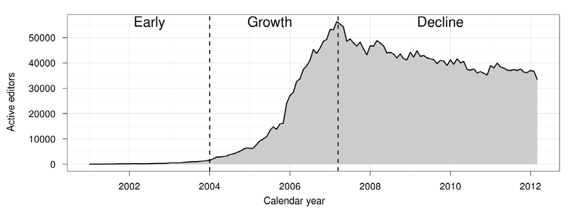

% You shall not publish: Edit filters on EN Wikipedia
% HCC Research Group Meeting June 2019
% Lusy

---

<small>Source: Halfaker et al. "The Rise and Decline of an Open Collaboration System: How Wikipedia’s reaction to popularity is causing its decline"</small>

---

## Overview

* Motivation
* State of the literature/Literature: What does the scientific community know
* Documentation: What is an edit filter and why was it introduced according to Wikipedia's/MediaWiki pages?
* Data Analysis: Edit filters on English Wikipedia
* Open questions

---

# Motivation

* What is the role of filters among existing (algorithmic) quality-control mechanisms (bots, semi-automated tools, ORES, humans)?  Which type of tasks do filters take over? 
* How have these tasks evolved over time (are they changes in the type, number, etc.)?
* What are suitable areas of application for rule-based systems such as filters in contrast to the other ML-based approaches?

---

## State of the Literature

* One thing is ostentatiously missing: edit filters

---

## What is an edit filter

* MediaWiki extension
* regex based filtering of edits and other actions (e.g. account creation, page deletion or move, upload)
* triggers *before* an edit is published
* different actions can be defined

---

## Motivations for its introduction

* disallow certain types of obvious pervasive (perhaps automated) vandalism directly
* takes more than a single click to revert
* human editors can use their time more productively elsewhere

---

## Edit filters in the quality control mechanisms frame

* the question of infrastructure
* guidelines say: for in-depth checks and problems with a particular article bots are better (don't use up resources)
* they were introduced before the ml tools came around.
* they probably work, so no one sees a reason to shut them down

---

* hypothesis: Wikipedia is a diy project driven by volunteers; they work on whatever they like to work
* hypothesis: it is easier to understand what's going on than it is with a ML tool. people like to use them for simplicity and transparency reasons
* hypothesis: it is easier to set up a filter than program a bot. Setting up a filter requires "only" understanding of regular expressions. Programming a bot requires knowledge of a programming language and understanding of the API.

---

# Data Analysis: Edit Filters on EN Wikipedia

---

## What do most active filters do?

    135  repeating characters & tag, warn
    30   "large deletion from article by new editors" & tag, warn
    61   "new user removing references" & tag
    18   "test type edits from clicking on edit bar" & deleted in Feb 2012
    3    "new user blanking articles" & tag, warn

---

## Descriptive statistics

    all filters: 954
    public filters: 361
    Active public filters: 110
    disabled (but not deleted) public filters: 35
    deleted public filters: 216
    hidden filters: 593
    active hidden filters: 91
    disabled (but not deleted) hidden filters: 118
    deleted hidden filters: 384

---

Number of filter hits per month March 2009-March 2019

---

Filters Actions

---

Active Public Filters Actions

---

Active Hidden Filters Actions

---

## Manual classification

*vandalism*, *good faith* and *maintenance*

* difficult to distinguish
* a lot of subcategories

---

Vandalism

    id  hits     public comment 
   	46	356945	 "Poop" vandalism
    365	85470	   Unusual changes to featured or good content
    16	2005	   Prolific socker I

---

Good Faith

    id  hits    public comment 
    180	175939	Large unwikified new article
    98	39401	  Creating very short new article

---

maintenance

    id  hits  public comment 
    577 1566  VisualEditor bugs: Strange icons
    345	13832	Extraneous formatting from browser extension
    942	1573	Log edits to protected pages

---

# Open Questions

--- 

## Current Limitations

* Only EN Wikipedia
* manual filter classification only conducted by me

---

## Bigger picture: Upload filters

<small>[https://upload.wikimedia.org/wikipedia/commons/c/c5/Blackout_of_wikipedia.de_by_Wikimedia_Deutschland_-_March_2019.png](https://upload.wikimedia.org/wikipedia/commons/c/c5/Blackout_of_wikipedia.de_by_Wikimedia_Deutschland_-_March_2019.png)</small>

---

# Thank you!

These slides are licensed under the [CC BY-SA 4.0 License](https://creativecommons.org/licenses/by-sa/4.0/).

---

# Questions? Comments? Thoughts?
