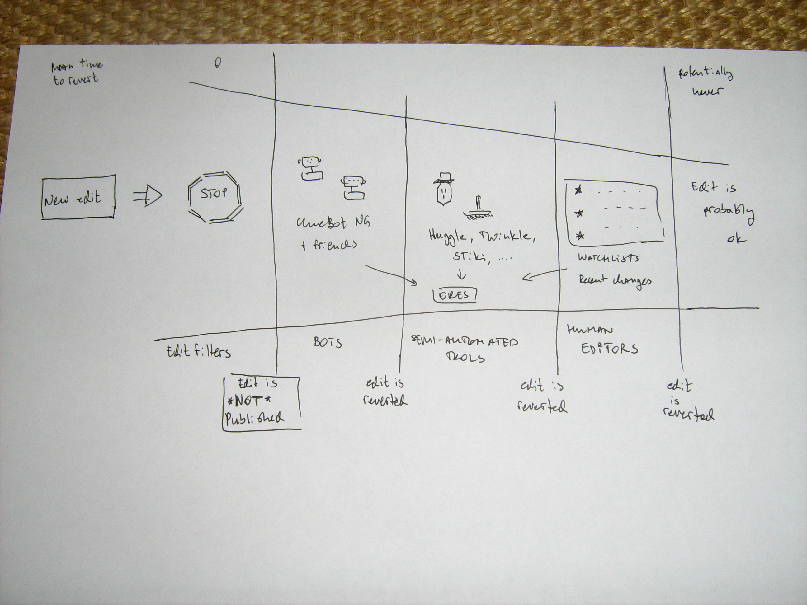
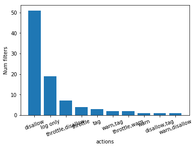

% You shall not publish: Edit filters on EN Wikipedia
% HCC Research Group Meeting June 2019
% Lusy

---

* Signpost/Intro
* overview over the presi so people can follow more easily
* Motivation: why do we want to study this: confluence questions
* funnel diagramm without filters: explain state of scientific literature on it
* key findings (high level)
* data analysis: what of this is really relevant

---

## Overview

* Motivation
* State of the literature/Literature: What does the scientific community know
* What is an edit filter and why was it introduced?/Documentation: What is an edit filter and why was it introduced according to Wikipedia's/MediaWiki pages?
* Data Analysis: Edit filters on English Wikipedia
* Open questions

---

## Edit filter, an example

---

# Motivation

What are edit filters?
Why are there edit filters?
What task(s) do they take care of?
How are they different from other existing mechanisms?
What is their role in Wikipedia's complex socio-technical system?

  Q1 We wanted to improve our understanding of the role of filters in existing algorithmic quality-control mechanisms (bots, ORES, humans).
  Q2 Which type of tasks do these filters take over in comparison to the other mechanisms? How these tasks evolve over time (are they changes in the type, number, etc.)?
  Q3 Since filters are classical rule-based systems, what are suitable areas of application for such rule-based system in contrast to the other ML-based approaches.

---

> "The edit filter is a tool that allows editors in the *edit filter manager* group to set controls mainly to address common patterns of harmful editing."

<small>[https://en.wikipedia.org/wiki/Wikipedia:Edit_filter](https://en.wikipedia.org/wiki/Wikipedia:Edit_filter)</small>

---

One thing is ostentatiously missing: edit filters

---

# Descriptive Overview. What is an edit filter?

---

---

* MediaWiki Extension
* regex based filtering

---

## Motivations for introducing the abuse filter extention

From [https://en.wikipedia.org/wiki/Wikipedia_talk:Edit_filter/Archive_1](https://en.wikipedia.org/wiki/Wikipedia_talk:Edit_filter/Archive_1):

* disallow certain types of obvious pervasive (perhaps automated) vandalism directly
* takes more than a single click to revert
* human editors can use their time more productively elsewhere

---

## Collaboration bots-filters

* MrZ Bot puts editors found on the abuse log often on the AIV noticeboard
* "There is a bot reporting users tripping certain filters at WP:AIV and WP:UAA; you can specify the filters here:" [https://en.wikipedia.org/wiki/User:DatBot/filters](https://en.wikipedia.org/wiki/User:DatBot/filters)

---

## Timeline

    Oct 2001 : automatically import entries from Easton’s Bible Dictionary by a script
    29 Mar 2002 : First version of https://en.wikipedia.org/wiki/Wikipedia:Vandalism (WP Vandalism is published)
    Oct 2002 : RamBot
    2006 : BAG was first formed
    13 Mar 2006 : 1st version of Bots/Requests for approval is published: some basic requirements (also valid today) are recorded
    28 Jul 2006 : VoABot II ("In the case were banned users continue to use sockpuppet accounts/IPs to add edits clearly rejected by consensus to the point were long term protection is required, VoABot may be programmed to watch those pages and revert those edits instead. Such edits are considered blacklisted. IP ranges can also be blacklisted. This is reserved only for special cases.")
    21 Jan 2007 : Twinkle Page is first published (empty), filled with a basic description by beginings of Feb 2007
    24 Jul 2007 : Request for Approval of original ClueBot
    16 Jan 2008 : Huggle Page is first published (empty)
    18 Jan 2008 : Huggle Page is first filled with content
    23 Jun 2008 : 1st version of Edit Filter page is published: User:Werdna announces they're currently developing the extention
     2 Oct 2008 : https://en.wikipedia.org/wiki/Wikipedia_talk:Edit_filter was first archived; its last topic was the voting for/against the extention which seemed to have ended end of Sep 2008
    Jun 2010 : STiki initial release
    20 Oct 2010 : ClueBot NG page is created
    11 Jan 2015 : 1st commit to github ORES repository
    30 Nov 2015 : ORES paper is published

---

---

## State of the Art on EN Wikipedia

---

## What do most active filters do?

    135  repeating characters & tag, warn
    30   "large deletion from article by new editors" & tag, warn
    61   "new user removing references" ("new user" is handled by "!("confirmed" in user\_groups)") & tag
    18   "test type edits from clicking on edit bar" (people don't replace Example texts when click-editing) & deleted in Feb 2012
    3    "new user blanking articles" & tag, warn
    172  "section blanking" & tag
    50   "shouting" (contribution consists of all caps, numbers and punctuation) & tag, warn
    98   "creating very short new article" & tag
    65   "excessive whitespace" (note: "associated with ascii art and some types of vandalism") & deleted in Jan 2010
    132  "removal of all categories" & tag, warn

---

## Descriptive statistics

    all filters: 954
    public filters: 361
    Active public filters: 110
    disabled (but not deleted) public filters: 35
    deleted public filters: 216
    hidden filters: 593
    active hidden filters: 91
    disabled (but not deleted) hidden filters: 118
    deleted hidden filters: 384

---

Number of filter hits per month March 2009-March 2019

---

Filters Actions

---

Active Public Filters Actions

---

Active Hidden Filters Actions

---

## Manual classification

*vandalism*, *good faith* and *maintenance*

---

# Next steps for finishing the thesis

* abuse_filter_history table (open MR, ping Aaron)

---

# Beyond the thesis

* What are the differences between how filters are governed on EN Wikipedia compared to other language versions?
* Are there filters targetting harassment?
* Ethnographic analysis (e.g. IVs with edit filter managers/admins/users whose edits have been disallowed would be really interesting)
* (how) has the notion of "vandalism" on Wikipedia evolved over time (when looking at the regex patterns)

---

* Precision/Recall: False Positives? were filters shut down, bc they matched more False positives than they had real value?
* What can we filter with a REGEX? And what not? Are regexes the suitable technology for the means the community is trying to achieve?

---

# Current Limitations

* Only EN Wikipedia
* manual filter classification only conducted by me

---

## Bigger picture: Upload filters

<small>[https://upload.wikimedia.org/wikipedia/commons/c/c5/Blackout_of_wikipedia.de_by_Wikimedia_Deutschland_-_March_2019.png](https://upload.wikimedia.org/wikipedia/commons/c/c5/Blackout_of_wikipedia.de_by_Wikimedia_Deutschland_-_March_2019.png)</small>

---

# Thank you!

These slides are licensed under the [CC BY-SA 4.0 License](https://creativecommons.org/licenses/by-sa/4.0/).

---

# Questions? Comments? Thoughts?
