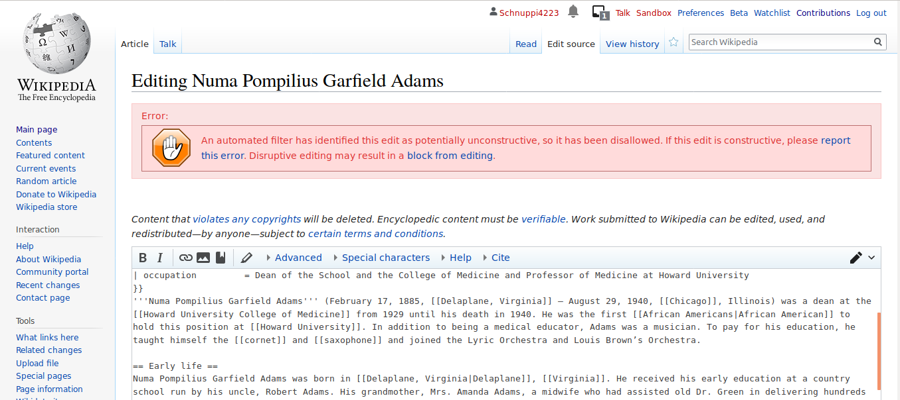

% You shall not publish this: Edit filters on EN Wikipedia
% HCC Research Group Meeting May 2019
% Lusy

---

# Edit filter, an example

---

# Motivation

What are edit filters?
Why are there edit filters?
What task(s) do they take care of?
How are they different from other existing mechanisms?

---

> "The edit filter is a tool that allows editors in the *edit filter manager* group to set controls mainly to address common patterns of harmful editing."

<small>[https://en.wikipedia.org/wiki/Wikipedia:Edit_filter](https://en.wikipedia.org/wiki/Wikipedia:Edit_filter)</small>

---

# Structure

(of the presi? or of the thesis?)

---

# Vandalism on Wikipedia

---

Def:

> "On Wikipedia, vandalism has a very specific meaning: editing (or other behavior) deliberately intended to obstruct or defeat the project's purpose, which is to create a free encyclopedia, in a variety of languages, presenting the sum of all human knowledge."

<small>[https://en.wikipedia.org/wiki/Wikipedia:Vandalism](https://en.wikipedia.org/wiki/Wikipedia:Vandalism)</small>

---

examples, tralala

---

# Fighting vandalism on Wikipedia

---

Lit review
bots, semi-automated tools, ores, humans

---

Summary:
funnel diagram (without filters)
One thing is ostentatiously missing: edit filters

---

(# Methods)

---

# Data

wikipedia's pages (policies, guidelines, etc.), most prominently: ...
abuse filters extention tables

---

# Results

---

## Motivations for introducing the abuse filter extention

---

## Timeline

---

funnel diagram with filters

---

## State of the Art on EN Wikipedia

Data analysis

---

# Current Limitations

---

# Bigger picture: Upload filters

---

# Next steps for finishing the thesis

* abuse_filter_history table (ping Aaron)

---

# Beyond the thesis

(long list of interesting questions)

---

# Thank you!

These slides are licensed under the [CC BY-SA 4.0 License](https://creativecommons.org/licenses/by-sa/4.0/).

---

# Questions? Comments? Thoughts?
