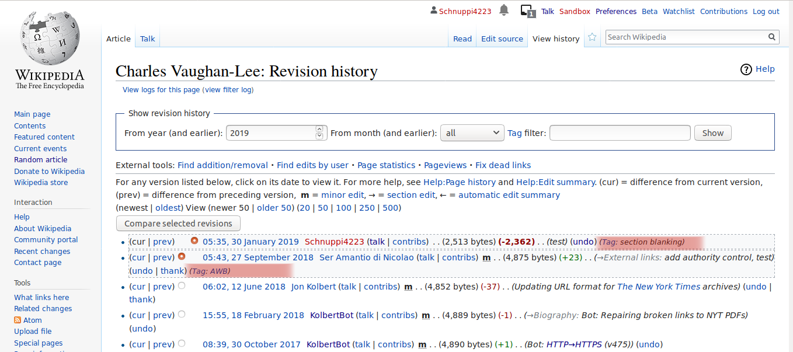

% You shall not publish this: Edit filters on EN Wikipedia
% HCC Research Group Meeting May 2019
% Lusy

---

## Edit filter, an example

---

# Motivation

What are edit filters?
Why are there edit filters?
What task(s) do they take care of?
How are they different from other existing mechanisms?

---

> "The edit filter is a tool that allows editors in the *edit filter manager* group to set controls mainly to address common patterns of harmful editing."

<small>[https://en.wikipedia.org/wiki/Wikipedia:Edit_filter](https://en.wikipedia.org/wiki/Wikipedia:Edit_filter)</small>

---

# Structure

(of the presi? or of the thesis?)

---

# Vandalism on Wikipedia

---

Def:

> "On Wikipedia, vandalism has a very specific meaning: editing (or other behavior) deliberately intended to obstruct or defeat the project's purpose, which is to create a free encyclopedia, in a variety of languages, presenting the sum of all human knowledge."

<small>[https://en.wikipedia.org/wiki/Wikipedia:Vandalism](https://en.wikipedia.org/wiki/Wikipedia:Vandalism)</small>

---

## Examples

---

# Fighting vandalism on Wikipedia

---

Literature review:

bots, semi-automated tools, ores, humans

---

## Important to study algorithmic mechamisms

* increased relative share of edits
* difference not only of scale but of substance
* intransparency and gatekeeping

---

## Bots

* 1st line of defence
* fastest revert time
* ClueBot NG, ...

---

## Semi-automated tools

* Huggle, Twinkle, STiki, ..

---

## ORES

* can be used by bots or semi-automated tools

---

## Humans

* watchlists
* manual reverts of chance discoveries

---

Summary:
funnel diagram (without filters)
One thing is ostentatiously missing: edit filters

---

(# Methods)

---

# Data

* wikipedia's pages (policies, guidelines, etc.), most prominently: ...
* abuse filter extention tables

---

# Descriptive Overview. What is an edit filter?

---

---

## MediaWiki Extension

* permissions
* tables: *abuse_filter*, *abuse_filter_log*, *abuse_filter_action* and *abuse_filter_history*
* actions filters trigger: logging, warning, throttling, disallowing, revoking auto-promoted groups, blocking, removing from privileged groups, range-blocking, tagging
* smth else?

---

## Introducing a new filter

For everybody:

* checklist: is an edit filter the suitable solution
\begin{itemize}
    \item "Filters are applied to all edits. Therefore, problematic changes that apply to a single page are likely not suitable for an edit filter."
    \item filters, after adding up, make editing slower
    \item in depth checks should be done by a separate software that users run on their own machines
    \item no trivial errors should be catched by filters (ala style guidelines)
    \item there are Titles Blacklist and Link/Spam Blacklist which should be used if the issue at hand has to do with a problematic title or link.
\end{itemize}
* request at: [https://en.wikipedia.org/wiki/Wikipedia:Edit_filter/Requested](https://en.wikipedia.org/wiki/Wikipedia:Edit_filter/Requested)

For edit filter managers:

* read the docs
* run tests
* Generally, always set action to logging only first
* Announce at [https://en.wikipedia.org/wiki/Wikipedia:Edit_filter_noticeboard](https://en.wikipedia.org/wiki/Wikipedia:Edit_filter_noticeboard) and receive feedback
* possibly change the filter action

---

## Who can edit filters

* *abusefilter-modify* permission
* March 9, 2019: 152 users in the *edit filter managers* group (and 1181 admins)
* (4 users on CA Wikipedia, and the role doesn't exist on the DE, ES, RU or BG wiki)

---

## How are problems handled

Edit Filter Noticeboard:

* current filters behaviour: e.g. changing filter action or updating pattern
* users rights discussions

[https://en.wikipedia.org/wiki/Wikipedia:Edit_filter/False_positives](https://en.wikipedia.org/wiki/Wikipedia:Edit_filter/False_positives):

* monitored by edit filter managers
* update filters
* help good faith users
* discourage malicious edits

Personal security best practices for edit filter managers

---

## Tripping a filter: Traces

---

---

## Motivations for introducing the abuse filter extention

Quote from EditFilter discussion archive

---

Also from the archive:
abuse filter -> edit filter

---

## Collaboration bots-filters

"There is a bot reporting users tripping certain filters at WP:AIV and WP:UAA; you can specify the filters here."
\url{https://en.wikipedia.org/wiki/User:DatBot/filters}

* consider collaborations filters/bots (e.g. MrZ Bot which puts editors found on the abuse log often on the AIV noticeboard.) are there further exampled for this kind of collaborations?

\url{https://en.wikipedia.org/wiki/Wikipedia:Administrator_intervention_against_vandalism}
\url{https://en.wikipedia.org/wiki/Wikipedia:Bots/Requests_for_approval/Mr.Z-bot_7}

---

## Timeline

    Oct 2001 : automatically import entries from Easton’s Bible Dictionary by a script
    29 Mar 2002 : First version of https://en.wikipedia.org/wiki/Wikipedia:Vandalism (WP Vandalism is published)
    Oct 2002 : RamBot
    2006 : BAG was first formed
    13 Mar 2006 : 1st version of Bots/Requests for approval is published: some basic requirements (also valid today) are recorded
    28 Jul 2006 : VoABot II ("In the case were banned users continue to use sockpuppet accounts/IPs to add edits clearly rejected by consensus to the point were long term protection is required, VoABot may be programmed to watch those pages and revert those edits instead. Such edits are considered blacklisted. IP ranges can also be blacklisted. This is reserved only for special cases.")
    21 Jan 2007 : Twinkle Page is first published (empty), filled with a basic description by beginings of Feb 2007
    24 Jul 2007 : Request for Approval of original ClueBot
    16 Jan 2008 : Huggle Page is first published (empty)
    18 Jan 2008 : Huggle Page is first filled with content
    23 Jun 2008 : 1st version of Edit Filter page is published: User:Werdna announces they're currently developing the extention
     2 Oct 2008 : https://en.wikipedia.org/wiki/Wikipedia_talk:Edit_filter was first archived; its last topic was the voting for/against the extention which seemed to have ended end of Sep 2008
    Jun 2010 : STiki initial release
    20 Oct 2010 : ClueBot NG page is created
    11 Jan 2015 : 1st commit to github ORES repository
    30 Nov 2015 : ORES paper is published

---

funnel diagram with filters

---

## State of the Art on EN Wikipedia

Data analysis of the abuse filter extension tables

---

+--------------------+---------------------+------+-----+---------+----------------+
| Field              | Type                | Null | Key | Default | Extra          |
+--------------------+---------------------+------+-----+---------+----------------+
| af_id              | bigint(20) unsigned | NO   | PRI | NULL    | auto_increment |
| af_pattern         | blob                | NO   |     | NULL    |                |
| af_user            | bigint(20) unsigned | NO   | MUL | NULL    |                |
| af_user_text       | varbinary(255)      | NO   |     | NULL    |                |
| af_timestamp       | binary(14)          | NO   |     | NULL    |                |
| af_enabled         | tinyint(1)          | NO   |     | 1       |                |
| af_comments        | blob                | YES  |     | NULL    |                |
| af_public_comments | tinyblob            | YES  |     | NULL    |                |
| af_hidden          | tinyint(1)          | NO   |     | 0       |                |
| af_hit_count       | bigint(20)          | NO   |     | 0       |                |
| af_throttled       | tinyint(1)          | NO   |     | 0       |                |
| af_deleted         | tinyint(1)          | NO   |     | 0       |                |
| af_actions         | varbinary(255)      | NO   |     |         |                |
| af_global          | tinyint(1)          | NO   |     | 0       |                |
| af_group           | varbinary(64)       | NO   | MUL | default |                |
+--------------------+---------------------+------+-----+---------+----------------+
\end{verbatim}
  \caption{abuse\_filter schema}~\label{fig:db-schemas-af}
\end{figure*}

---

\begin{figure*}
\begin{verbatim}
abuse_filter_log
+------------------+---------------------+------+-----+---------+----------------+
| Field            | Type                | Null | Key | Default | Extra          |
+------------------+---------------------+------+-----+---------+----------------+
| afl_id           | bigint(20) unsigned | NO   | PRI | NULL    | auto_increment |
| afl_filter       | varbinary(64)       | NO   | MUL | NULL    |                |
| afl_user         | bigint(20) unsigned | NO   | MUL | NULL    |                |
| afl_user_text    | varbinary(255)      | NO   |     | NULL    |                |
| afl_ip           | varbinary(255)      | NO   | MUL | NULL    |                |
| afl_action       | varbinary(255)      | NO   |     | NULL    |                |
| afl_actions      | varbinary(255)      | NO   |     | NULL    |                |
| afl_var_dump     | blob                | NO   |     | NULL    |                |
| afl_timestamp    | binary(14)          | NO   | MUL | NULL    |                |
| afl_namespace    | tinyint(4)          | NO   | MUL | NULL    |                |
| afl_title        | varbinary(255)      | NO   |     | NULL    |                |
| afl_wiki         | varbinary(64)       | YES  | MUL | NULL    |                |
| afl_deleted      | tinyint(1)          | NO   |     | 0       |                |
| afl_patrolled_by | int(10) unsigned    | YES  |     | NULL    |                |
| afl_rev_id       | int(10) unsigned    | YES  | MUL | NULL    |                |
| afl_log_id       | int(10) unsigned    | YES  | MUL | NULL    |                |
+------------------+---------------------+------+-----+---------+----------------+
\end{verbatim}
  \caption{abuse\_filter\_log schema}~\label{fig:db-schemas-afl}
\end{figure*}

---

\begin{figure*}
\begin{verbatim}
abuse_filter_history
+---------------------+---------------------+------+-----+---------+----------------+
| Field               | Type                | Null | Key | Default | Extra          |
+---------------------+---------------------+------+-----+---------+----------------+
| afh_id              | bigint(20) unsigned | NO   | PRI | NULL    | auto_increment |
| afh_filter          | bigint(20) unsigned | NO   | MUL | NULL    |                |
| afh_user            | bigint(20) unsigned | NO   | MUL | NULL    |                |
| afh_user_text       | varbinary(255)      | NO   | MUL | NULL    |                |
| afh_timestamp       | binary(14)          | NO   | MUL | NULL    |                |
| afh_pattern         | blob                | NO   |     | NULL    |                |
| afh_comments        | blob                | NO   |     | NULL    |                |
| afh_flags           | tinyblob            | NO   |     | NULL    |                |
| afh_public_comments | tinyblob            | YES  |     | NULL    |                |
| afh_actions         | blob                | YES  |     | NULL    |                |
| afh_deleted         | tinyint(1)          | NO   |     | 0       |                |
| afh_changed_fields  | varbinary(255)      | NO   |     |         |                |
| afh_group           | varbinary(64)       | YES  |     | NULL    |                |
+---------------------+---------------------+------+-----+---------+----------------+
\end{verbatim}
  \caption{abuse\_filter\_history schema}~\label{fig:db-schemas-afh}
\end{figure*}

---

\begin{figure*}
\begin{verbatim}
abuse_filter_action
+-----------------+---------------------+------+-----+---------+-------+
| Field           | Type                | Null | Key | Default | Extra |
+-----------------+---------------------+------+-----+---------+-------+
| afa_filter      | bigint(20) unsigned | NO   | PRI | NULL    |       |
| afa_consequence | varbinary(255)      | NO   | PRI | NULL    |       |
| afa_parameters  | tinyblob            | NO   |     | NULL    |       |
+-----------------+---------------------+------+-----+---------+-------+
\end{verbatim}

---

## What do most active filters do?

\begin{table*}
  \centering
    \begin{tabular}{r p{10cm} p{5cm} }
    % \toprule
    Filter ID & Publicly available description & Actions \\
    \hline
      135 & repeating characters & tag, warn \\
      30 & "large deletion from article by new editors" & tag, warn \\
      61 & "new user removing references" ("new user" is handled by "!("confirmed" in user\_groups)") & tag \\
      18 & "test type edits from clicking on edit bar" (people don't replace Example texts when click-editing) & deleted in Feb 2012 \\
      3 & "new user blanking articles" & tag, warn \\
      172 & "section blanking" & tag \\
      50 & "shouting" (contribution consists of all caps, numbers and punctuation) & tag, warn \\
      98 & "creating very short new article" & tag \\
      65 & "excessive whitespace" (note: "associated with ascii art and some types of vandalism") & deleted in Jan 2010 \\
      132 & "removal of all categories" & tag, warn \\
      225 & "vandalism in all caps" (difference to 50? seems to be swear words, but shouldn't they be catched by 50 anyway?) & disallow \\
      189 & "BLP vandalism or libel" & tag \\
      402 & "new article without references" & deleted in Apr 2013, before that disabled with comment "disabling, no real use" \\
      384 & "addition of bad words or other vandalism" (seems to be a blacklist) & disallow \\
      432 & "starting new line with lower case letters" & tag, warn //I recall there was a rule of thumb recommending not to user filters for style things? although that's not really style, but rather wrong grammar.. \\
      380 & hidden; public comment "multiple obscenities" & disallow \\
      351 & "text added after categories and interwiki" & tag, warn \\
      279 & "repeated attempts to vandalise" & tag, throttle (triggered when someone hits "edit" repeatedly in a short ammount of time) \\
      491 & "edits ending with emoticons or !" & tag, warn \\
      636 & "unexplained removal of sourced content" & warn (that, together with 634 and 635 refutes my theory that warn always goes together with tag) \\
      231 & "long string of characters containing no spaces" (that's surely english though^^) & tag, warn \\
      650 & "creation of a new article without any categories" & (log only) \\
      527 & hidden; public comments "T34234: log/throttle possible sleeper account creations" & throttle \\
      633 & "possible canned edit summary" (apparently pre-filled on mobile though) & tag \\
      686 & "IP adding possible unreferenced material to BLP" (BLP= biography of living people? I thought, it was forbidden to edit them without a registered account) & (log only) \\
      712 & "possibly changing date of birth in infobox" ("possibly"? and I thought infoboxes were pre-generated from wikidata?) & (log only) \\
      833 & "newer user possibly adding a unreferenced or improperly referenced material" & (log only) \\
  \end{tabular}
\end{table*}

---

## Descriptive statistics

see jupyter notebook for diagrams

---

## Public and hidden filters

* 2/3 of filters are hidden
* all admins can view hidden filters
* mailinglist for discussing private filters

---

## Manual classification

*vandalism*, *good faith* and *maintenance*

---

diagram with sublables

---

check memos

---

# Next steps for finishing the thesis

* abuse_filter_history table (ping Aaron)

---

# Beyond the thesis

* What are the differences between how filters are governed on EN Wikipedia compared to other language versions?
* Are there filters targetting harassment?
* Ethnographic analysis (e.g. IVs with edit filter managers/admins/users whose edits have been disallowed would be really interesting)
* (how) has the notion of "vandalism" on Wikipedia evolved over time (when looking at the regex patterns)
* Precision/Recall: False Positives? were filters shut down, bc they matched more False positives than they had real value?
* Do filters work the desired way/help for a smoother Wikipedia service or is it a lot of work to maintain them and the usefulness is questionable?
* What can we filter with a REGEX? And what not? Are regexes the suitable technology for the means the community is trying to achieve?

---

# Current Limitations

* Only EN Wikipedia
* manual filter classification only conducted by me

---

## Bigger picture: Upload filters

<small>[https://upload.wikimedia.org/wikipedia/commons/c/c5/Blackout_of_wikipedia.de_by_Wikimedia_Deutschland_-_March_2019.png](https://upload.wikimedia.org/wikipedia/commons/c/c5/Blackout_of_wikipedia.de_by_Wikimedia_Deutschland_-_March_2019.png)</small>

---

# Thank you!

These slides are licensed under the [CC BY-SA 4.0 License](https://creativecommons.org/licenses/by-sa/4.0/).

---

# Questions? Comments? Thoughts?
